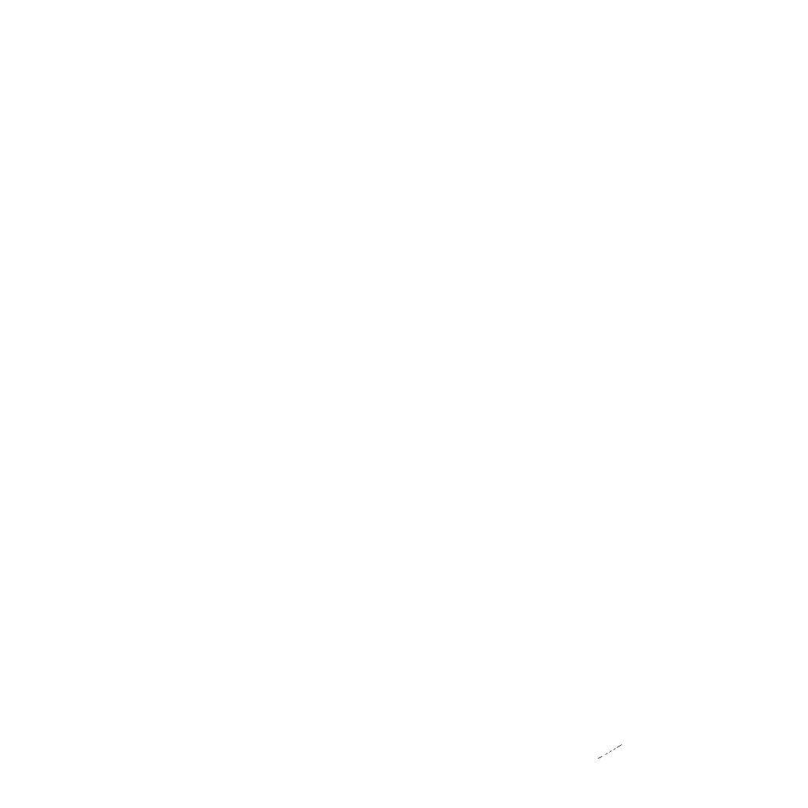

![views] ![stars] ![forks] ![issues] ![license] ![repo-size]

<picture>
  <source media="(prefers-color-scheme: dark)" srcset="./public/nextjs-light.svg">
  <source media="(prefers-color-scheme: light)" srcset="./public/nextjs-dark.svg">
  
</picture>

# Masked Emotions

## 📜 License

This project is licensed under the MIT License - see the [LICENSE](LICENSE) file for details.

## 👤 Author

This application was developed by

- **Khushal Agarwal -** [Khushal-ag](https://github.com/Khushal-ag)
- **Nandini Sharma -** [nandiniV-18](https://github.com/nandiniV-18)
- **Sunishka Sharma -** [sunishka-30](https://github.com/sunishka-30)
- **Yuvraj Soni -** [Yuvraj2172](https://github.com/Yuvraj2172)

## ☢️ Contributors

[![][contributors]][contributors-graph]

_Note: It may take up to 24h for the [contrib.rocks][contrib-rocks] plugin to update because it's refreshed once a day._

<!----------------------------------{ Labels }--------------------------------->

[views]: https://komarev.com/ghpvc/?username=masked-emotions&label=view%20counter&color=red&style=flat
[repo-size]: https://img.shields.io/github/repo-size/Khushal-ag/masked-emotions
[issues]: https://img.shields.io/github/issues-raw/Khushal-ag/masked-emotions
[license]: https://img.shields.io/github/license/Khushal-ag/masked-emotions
[forks]: https://img.shields.io/github/forks/Khushal-ag/masked-emotions?style=flat
[stars]: https://img.shields.io/github/stars/Khushal-ag/masked-emotions
[contributors]: https://contrib.rocks/image?repo=Khushal-ag/masked-emotions&max=500
[contributors-graph]: https://github.com/Khushal-ag/masked-emotions/graphs/contributors
[contrib-rocks]: https://contrib.rocks/preview?repo=Khushal-ag%2Fmasked-emotions
